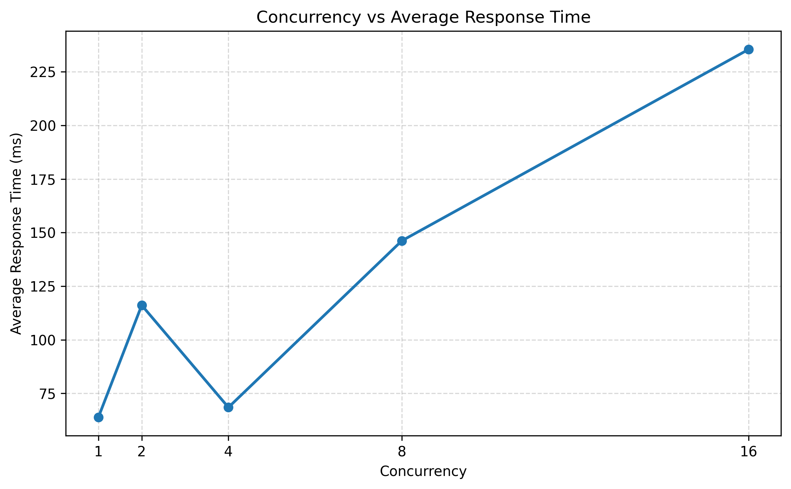
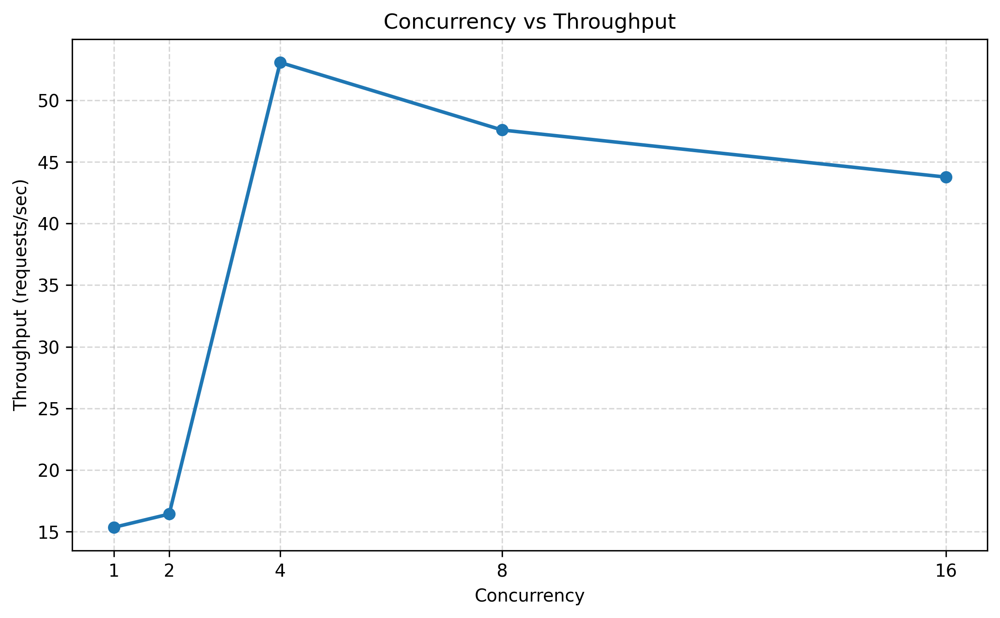
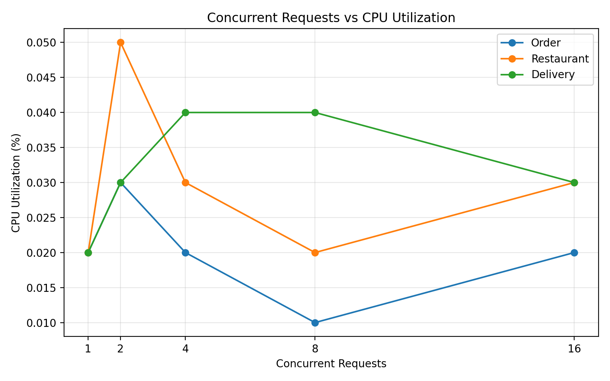
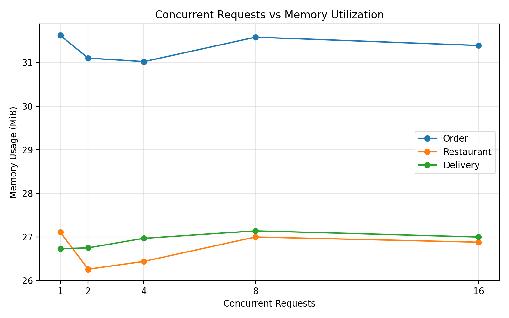

# Food Delivery Microservices

## 1. Project Overview

This project implements a food delivery application using a microservice architecture.

The application is divided into three independent services:

- **Restaurant Service** – manages restaurants, menus, and item availability.
- **Delivery Service** – manages delivery creation, assignment, and delivery status.
- **Order Service** – manages orders and communicates with the Restaurant and Delivery Services.

The services are developed as independent REST APIs and are containerized using Docker. Docker Compose is used to deploy the services together on a common Docker network.

The project also performs workload testing at different concurrency levels and monitors Docker resource usage to analyze system performance.

---

## 2. Aim

To develop a microservice-based food delivery application with three independent services, containerize and deploy them using Docker and Docker Compose, establish inter-service communication, perform workload testing, monitor resource usage, and analyze the performance of the system.

---

## 3. Project Objectives

1.Develop three independent microservices for a food delivery application.
2.Implement REST APIs for Restaurant, Delivery, and Order management.
3.Containerize each microservice using Docker.
4.Deploy and manage all services using Docker Compose.
5.Establish communication between the microservices through a common Docker network.
6.Validate end-to-end communication between the Order, Restaurant, and Delivery Services.
7.Perform workload testing at different concurrency levels.
8.Monitor CPU and memory usage of the Docker containers.
9.Analyze response time and throughput under different workloads.
10.Identify performance trends and resource usage of the services.

---

## 4. System Architecture

The Food Delivery application is designed using a microservice architecture consisting of three independent services: Order Service, Restaurant Service, and Delivery Service.


The Order Service handles order operations and communicates with the Restaurant Service for restaurant and menu validation and with the Delivery Service for delivery creation.

The Order Service acts as the central service for order creation. During order processing, it communicates with the Restaurant Service to validate restaurant/menu information and with the Delivery Service to create a delivery.

---

## 5. Technologies Used

| Technology | Purpose |
|---|---|
| Python | Service implementation |
| Flask | REST API development |
| Requests | Inter-service communication |
| Docker | Containerization |
| Docker Compose | Multi-service deployment |
| Docker Network | Communication between containers |
| Python ThreadPoolExecutor | Workload testing |
| Docker Stats | Resource monitoring |
| Matplotlib | Performance graphs |

---

# 6. Microservices

## 6.1 Restaurant Service

The Restaurant Service manages restaurant information, menus, and item availability.

### Responsibilities

- Manage restaurant information
- Provide restaurant details
- Provide menu information
- Check restaurant availability
- Check menu item availability

### Port

```text
5000
````

### APIs

| Method | Endpoint                                        | Description                   |
| ------ | ----------------------------------------------- | ----------------------------- |
| GET    | `/`                                             | Service information           |
| GET    | `/restaurants`                                  | Get restaurants               |
| GET    | `/restaurants/<id>`                             | Get restaurant details        |
| GET    | `/restaurants/<id>/menu`                        | Get restaurant menu           |
| GET    | `/restaurants/<id>/menu/<item_id>`              | Get menu item                 |
| GET    | `/restaurants/<id>/availability`                | Check restaurant availability |
| GET    | `/restaurants/<id>/menu/<item_id>/availability` | Check item availability       |

---

## 6.2 Delivery Service

The Delivery Service manages delivery records and delivery status.

### Responsibilities

* Create deliveries
* Retrieve delivery information
* Assign delivery personnel
* Update delivery status
* Track delivery status

### Port

```text
5001
```

### APIs

| Method | Endpoint                  | Description            |
| ------ | ------------------------- | ---------------------- |
| GET    | `/`                       | Service information    |
| POST   | `/deliveries`             | Create delivery        |
| GET    | `/deliveries/<id>`        | Get delivery details   |
| PUT    | `/deliveries/<id>/assign` | Assign delivery person |
| PUT    | `/deliveries/<id>/status` | Update delivery status |
| GET    | `/deliveries/<id>/status` | Get delivery status    |

---

## 6.3 Order Service

The Order Service manages food orders and coordinates with the other two services.

### Responsibilities

* Create orders
* Retrieve orders
* Update order status
* Validate restaurant and menu information
* Request delivery creation
* Communicate with Restaurant and Delivery Services

### Port

```text
5002
```

### APIs

| Method | Endpoint                    | Description         |
| ------ | --------------------------- | ------------------- |
| POST   | `/orders`                   | Create an order     |
| GET    | `/orders/<order_id>`        | Get order details   |
| PUT    | `/orders/<order_id>/status` | Update order status |

---

# 7. Running the Services

The services can be run independently during development and testing.

Example:

```bash
python app.py
```

The services use the following ports:

```text
Restaurant Service → 5000
Delivery Service   → 5001
Order Service      → 5002
```

---

# 8. Docker Containerization

Each microservice contains its own Dockerfile.

The services are deployed together using Docker Compose.

### Build the services

```bash
docker compose build
```


### Start the services

```bash
docker compose up -d
```

### Check running containers

```bash
docker compose ps
```


The application runs three containers:

```text
restaurant-service

delivery-service

order-service
```

---

# 9. Docker Network

The three services are connected through a common Docker network:

```text
food-delivery-network
```

This allows the containers to communicate with each other using their Docker service names.


---

# 10. Inter-Service Communication

The Order Service communicates with the other services during order creation.


The final order response contains information related to the order, restaurant, and delivery.

---

# 11. Workload Testing

Workload testing was performed using concurrent requests to the Order Service.

The following concurrency levels were tested:

```text
1
2
4
8
16
```

The following parameters were recorded:

* Total requests
* Successful requests
* Failed requests
* Average response time
* Throughput

### Workload Results

| Concurrency | Total Requests | Successful | Failed | Avg. Response Time (ms) | Throughput (req/s) |
| ----------: | -------------: | ---------: | -----: | ----------------------: | -----------------: |
|           1 |              1 |          1 |      0 |                   63.87 |              15.35 |
|           2 |              2 |          2 |      0 |                  116.14 |              16.43 |
|           4 |              4 |          4 |      0 |                   68.49 |              53.07 |
|           8 |              8 |          8 |      0 |                  146.21 |              47.59 |
|          16 |             16 |         16 |      0 |                  235.48 |              43.77 |

---

# 12. Resource Monitoring

Docker resource usage was monitored using:

```bash
docker stats --no-stream
```

The monitored resources included:

* CPU usage
* Memory usage

The Order Service consistently showed the highest memory usage at approximately 31 MiB, while the Restaurant and Delivery Services used approximately 26–27 MiB.

CPU utilization remained very low across the tested workload levels.

---

# 13. Performance Analysis

Two graphs were generated from the workload results.

### Concurrency vs Average Response Time



### Concurrency vs Throughput




### Resource Monitoring

Resource utilization was monitored for all three services using `docker stats --no-stream` at different workload levels. CPU utilization remained low, while memory usage stayed relatively stable across the tested concurrency levels.

### Concurrency vs CPU Utilization



### Concurrency vs Memory Utilization



### Observations

* All tested requests were successful.
* No request failures were observed.
* Concurrency 4 produced the highest measured throughput of **53.07 requests/sec**.
* Increasing concurrency beyond 4 increased average response time.
* Throughput decreased from 53.07 requests/sec at concurrency 4 to 43.77 requests/sec at concurrency 16.
* CPU usage remained low and memory usage remained relatively stable.
* The Order Service was the highest memory-consuming service.

---

# 14. Project Structure

```text
food-delivery-microservices/

├── restaurant-service/
│   ├── app.py
│   ├── Dockerfile
│   ├── requirements.txt
│   └── README.md

├── delivery-service/
│   ├── app.py
│   ├── Dockerfile
│   ├── requirements.txt
│   ├── README.md
│   └── tests/
│       └── test_delivery.py

├── order-service/
│   ├── app.py
│   ├── Dockerfile
│   └── requirements.txt

├── results/
│   ├── workload_test.py
│   ├── workload-results.csv
│   ├── create_graph.py
│   ├── concurrency-vs-response-time.png
│   └── concurrency-vs-throughput.png

├── screenshots/
│   ├── 3 services build.jpg
│   ├── Docker Network.png
│   ├── docker-compose-up and ps.png
│   ├── Inter-Service Communication.png
│   └── workload-testing/
│       ├── level-1/
│       ├── level-2/
│       ├── level-4/
│       ├── level-8/
│       └── level-16/

├── docker-compose.yml
├── Food Delivery Microservices Architecture.png
└── README.md
```

---

# 15. Conclusion

The Food Delivery Microservices application was successfully developed using three independent services: Restaurant, Delivery, and Order.

The services were containerized using Docker and deployed using Docker Compose on a common network. Inter-service communication was established between the Order, Restaurant, and Delivery Services.

Workload testing was performed at five concurrency levels. The system successfully handled all tested requests without failures. The performance analysis showed that concurrency 4 produced the highest measured throughput, while higher concurrency levels resulted in increased response time and reduced throughput.

Overall, the project demonstrates microservice development, containerization, service communication, workload testing, resource monitoring, and performance analysis.

---

# 16. Contributors
* **Abhinandan**
* **Bhavana**
* **Pradeep**
* **Zakiya**


```
