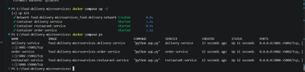

# Order Service

The Order Service is one of the three independent microservices in the **Food Delivery Microservices** application.

It is responsible for managing customer orders and coordinating order-related operations with the Restaurant Service and Delivery Service.

---

## 1. Overview

The Order Service handles the order-related operations of the food delivery application.

It provides REST APIs for:

- Creating orders
- Retrieving order information
- Managing order details
- Processing customer orders
- Communicating with the Restaurant Service
- Communicating with the Delivery Service

The service runs independently as a microservice and participates in the complete food delivery workflow.

---

## 2. Responsibilities

The Order Service is responsible for the following operations:

- Create customer orders
- Store order information
- Retrieve order details
- Process order requests
- Connect orders with restaurants and menu items
- Communicate with the Restaurant Service
- Communicate with the Delivery Service
- Handle order-related requests
- Provide appropriate API responses

---

## 3. Technology Used

| Technology | Purpose |
|---|---|
| Python | Service implementation |
| Flask | REST API framework |
| REST API | Service communication |
| Docker | Containerization |
| Docker Compose | Multi-service deployment |

---

## 4. Service Port

The Order Service runs on:

```text
5002
````

When running locally:

```text
http://localhost:5002
```

---

## 5. API Endpoints

| Method | Endpoint       | Description                       |
| ------ | -------------- | --------------------------------- |
| GET    | `/`            | Returns Order Service information |
| GET    | `/orders`      | Retrieves order information       |
| POST   | `/orders`      | Creates a new order               |
| GET    | `/orders/<id>` | Retrieves a specific order        |

---

## 6. Order Processing

The Order Service acts as the main order-processing component of the food delivery application.

A typical order flow is:

```text
Customer
    │
    ▼
Order Service
    │
    ▼
Restaurant Service
    │
    ▼
Order Processing
    │
    ▼
Delivery Service
    │
    ▼
Order Completed
```

The Order Service coordinates the order information between the different services.

---

## 7. API Testing

The Order Service was tested using its REST API endpoints.

### 7.1 Order Service Running

The Order Service was started successfully and tested on port `5002`.


---

### 7.2 Create Order

A new order can be created through the Order Service API.

The request contains the required information for processing the customer order.


The Order Service receives the request and processes the order information.

---

### 7.3 Order Data

After an order is created, the Order Service maintains the order information required for further processing.

The order information can include:

* Order ID
* Customer information
* Restaurant information
* Menu item information
* Quantity
* Order status

---

## 8. Running the Service Locally

### Step 1: Install Dependencies

Install the required Python packages:

```bash
pip install -r requirements.txt
```

### Step 2: Start the Service

Run:

```bash
python app.py
```

The service will start on:

```text
http://localhost:5002
```

---

## 9. Running with Docker

The Order Service contains its own `Dockerfile`, allowing it to be built and executed independently.

### 9.1 Build the Docker Image

```bash
docker build -t order-service .
```

The Docker image can be built independently for the Order Service.

### 9.2 Run the Container

```bash
docker run -p 5002:5002 order-service
```

The service will then be accessible at:

```text
http://localhost:5002
```


---

## 10. Docker Compose Deployment

The Order Service is deployed together with the Restaurant Service and Delivery Service using Docker Compose.

The three services are connected through a common Docker network.

### Docker Network


### Docker Compose

The complete application can be started using Docker Compose.

```bash
docker-compose up
```



The three microservices are deployed together as part of the complete food delivery application.

---

## 11. Role in the Overall System

The Order Service acts as the central order-processing component of the application.

The overall workflow is:

1. The customer places an order.
2. The Order Service receives the order request.
3. The Order Service processes the order information.
4. The Restaurant Service provides restaurant and menu information.
5. The order is processed after the required information is available.
6. The Delivery Service handles delivery-related operations.
7. The order progresses through the complete food delivery workflow.

### Interaction Flow

```text
Customer
   │
   │ Place Order
   ▼
Order Service
   │
   │ Restaurant / Menu Request
   ▼
Restaurant Service
   │
   │ Restaurant & Menu Information
   ▼
Order Service
   │
   │ Delivery Request
   ▼
Delivery Service
   │
   │ Delivery Information
   ▼
Order Service
   │
   ▼
Order Completed
```


---

## 12. Inter-Service Communication

The Order Service communicates with the other microservices through HTTP-based service communication.

### Order Service → Restaurant Service

The Order Service can request restaurant and menu-related information from the Restaurant Service.

```text
Order Service
      │
      │ HTTP Request
      ▼
Restaurant Service
      │
      │ Restaurant / Menu Information
      ▼
Order Service
```

### Order Service → Delivery Service

After order processing, the Order Service communicates with the Delivery Service for delivery-related operations.

```text
Order Service
      │
      │ HTTP Request
      ▼
Delivery Service
      │
      │ Delivery Information
      ▼
Order Service
```

### Complete Communication

```text
                    Food Delivery Application

                             │
             ┌───────────────┼───────────────┐
             │               │               │
             ▼               ▼               ▼
       Restaurant       Order Service    Delivery Service
        Service              │               │
          :5000              │               :5001
                             │
                             ▼
                       Order Processing
```


---

## 13. Order Data

The Order Service maintains information associated with customer orders.

An order can contain information such as:

```json
{
    "order_id": 1,
    "customer_id": 1,
    "restaurant_id": 101,
    "item_id": 1,
    "quantity": 2
}
```

The order information allows the application to associate a customer request with the selected restaurant and menu item.

---

## 14. Project Structure

```text
order-service/

│
├── app.py
│
├── Dockerfile
│
├── requirements.txt
│
├── README.md
│
└── tests/
    └── test_order.py
```

---

## 15. Testing

The Order Service was tested using its REST APIs and through integration with the other microservices.

The testing verifies:

* Order Service availability
* Order creation
* Order information handling
* API request processing
* Inter-service communication
* Docker deployment
* Docker Compose integration

The Order Service was also tested as part of the complete three-service application.

---

## 16. Docker Integration

The Order Service is integrated into the complete application using Docker Compose.

The application contains three independent services:

```text
Restaurant Service
        │
        ▼
   Order Service
        │
        ▼
  Delivery Service
```

The three services are built and deployed together.


Each service has:

* Its own application code
* Its own dependencies
* Its own Dockerfile
* Its own API endpoints
* Independent service responsibilities

---

## 17. Key Features

* Independent order management service
* REST API based communication
* Customer order processing
* Order creation
* Order information management
* Restaurant Service communication
* Delivery Service communication
* Docker containerization
* Docker Compose integration
* Inter-service communication
* API testing
* Three-service integration

---

## 18. Conclusion

The Order Service provides an independent component for managing customer orders in the Food Delivery Microservices application.

It demonstrates how order processing can be separated into an independent microservice with its own APIs, Docker container, and service logic.

The Order Service communicates with the Restaurant Service for restaurant and menu-related information and works with the Delivery Service as part of the overall food delivery workflow.

Together with the Restaurant Service and Delivery Service, it forms the complete microservices-based food delivery application.

```
